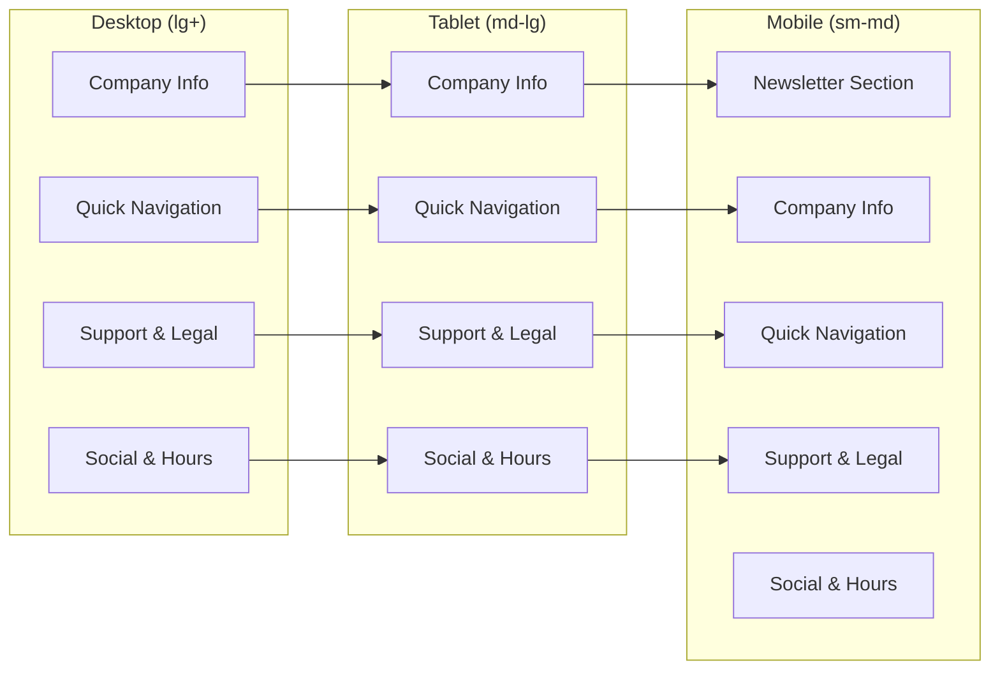
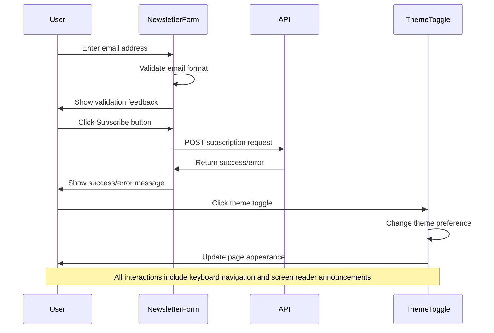
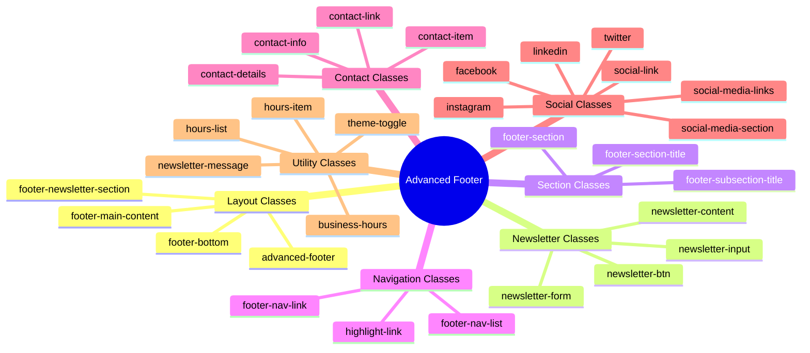

# Footer Layout Mermaid Diagram

## Footer Structure Overview

```mermaid
flowchart TD
    A[Advanced Footer] --> B[Newsletter Section]
    A --> C[Main Footer Content]
    A --> D[Footer Bottom]
    
    B --> B1[Newsletter Content]
    B --> B2[Subscription Form]
    
    B1 --> B1A[Title: Stay in the loop]
    B1 --> B1B[Subtitle with description]
    
    B2 --> B2A[Email Input Field]
    B2 --> B2B[Subscribe Button]
    B2 --> B2C[Privacy Notice]
    
    C --> E[Column 1: Company Info]
    C --> F[Column 2: Quick Navigation]
    C --> G[Column 3: Support & Legal]
    C --> H[Column 4: Social & Hours]
    
    E --> E1[Company Logo & Name]
    E --> E2[Company Description]
    E --> E3[Contact Information]
    
    E3 --> E3A[Address with icon]
    E3 --> E3B[Phone with link]
    E3 --> E3C[Email with link]
    
    F --> F1[Explore Section]
    F1 --> F1A[Browse All Listings]
    F1 --> F1B[Beachfront Homes]
    F1 --> F1C[Mountain Retreats]
    F1 --> F1D[Urban Escapes]
    F1 --> F1E[Cozy Cabins]
    F1 --> F1F[Become a Host]
    
    G --> G1[Support & Help]
    G1 --> G1A[Help Center]
    G1 --> G1B[Contact Us]
    G1 --> G1C[FAQ]
    G1 --> G1D[Safety Information]
    G1 --> G1E[Cancellation Policy]
    
    G --> G2[Legal Section]
    G2 --> G2A[Privacy Policy]
    G2 --> G2B[Terms of Service]
    G2 --> G2C[Cookie Policy]
    
    H --> H1[Social Media Section]
    H1 --> H1A[Social Media Text]
    H1 --> H1B[Facebook Link]
    H1 --> H1C[Instagram Link]
    H1 --> H1D[Twitter Link]
    H1 --> H1E[LinkedIn Link]
    
    H --> H2[Business Hours]
    H2 --> H2A[Monday-Friday]
    H2 --> H2B[Weekend Hours]
    H2 --> H2C[Holiday Hours]
    
    D --> D1[Copyright Information]
    D --> D2[Bottom Navigation Links]
    D --> D3[Theme Toggle]
    
    D2 --> D2A[Sitemap]
    D2 --> D2B[Accessibility]
    D2 --> D2C[Theme Toggle Button]

    style A fill:#e1f5fe
    style B fill:#f3e5f5
    style C fill:#e8f5e8
    style D fill:#fff3e0
    style E fill:#ffebee
    style F fill:#e0f2f1
    style G fill:#f1f8e9
    style H fill:#fff8e1
```

## Responsive Layout Structure

## Component Hierarchy

```mermaid
graph TD
    Footer[Advanced Footer]
    
    Newsletter[Newsletter Section]
    Main[Main Content Area]
    Bottom[Footer Bottom]
    
    Newsletter --> NewsletterContent[Newsletter Content]
    Newsletter --> NewsletterForm[Newsletter Form]
    
    Main --> Col1[Company Info Column]
    Main --> Col2[Quick Navigation Column]
    Main --> Col3[Support & Legal Column]
    Main --> Col4[Social Media Column]
    
    Col1 --> Logo[Company Logo]
    Col1 --> Description[Company Description]
    Col1 --> ContactInfo[Contact Information]
    
    Col2 --> ExploreLinks[Explore Navigation]
    
    Col3 --> SupportLinks[Support Links]
    Col3 --> LegalLinks[Legal Links]
    
    Col4 --> SocialLinks[Social Media Links]
    Col4 --> Hours[Business Hours]
    
    Bottom --> Copyright[Copyright]
    Bottom --> BottomLinks[Bottom Navigation]
    Bottom --> ThemeToggle[Theme Toggle]
    
    style Footer fill:#1976d2,color:#fff
    style Newsletter fill:#9c27b0,color:#fff
    style Main fill:#388e3c,color:#fff
    style Bottom fill:#f57c00,color:#fff
```

## Interaction Flow

## CSS Class Structure

This visual representation shows the comprehensive structure and organization of the advanced footer design, including responsive behavior, component hierarchy, and styling approach.
